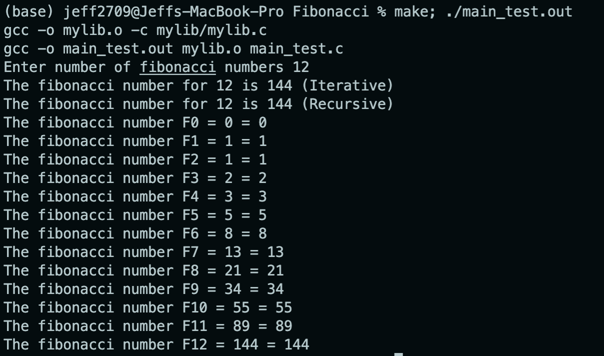
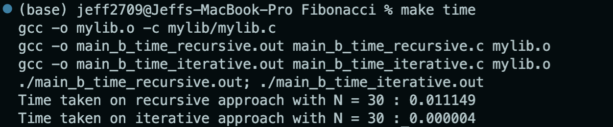

# Fibonacci

In this assignment, I will compare the time and space complexity of the iterative and recursive approach to the Fibonacci sequence and test the result based on these algorithms.

### Fibonacci Iterative Approach

```c
int fibonacciIterative(int N) {
    
    int num1 = 0, num2 = 1, nextnum;

    if (N == 0) {
        return num1;
    } else if (N == 1){
        return num2;
    } else {
        for (int i = 2; i <= N; i++) {
            nextnum = num1 + num2;
            num1 = num2;
            num2 = nextnum; 
        }
        return nextnum;
    }

}
```

### Fibonacci Recursive Approach

```c
int fibonacciRecursive(int N) {

    if (N == 0){
        return 0;
    } else if (N == 1){
        return 1;
    } else {
        return fibonacciRecursive(N-1) + fibonacciRecursive(N-2);
    }
    
}
```

# Testing

The main idea of this testing process is to test the functionality of my implementation code of my iterative and recursive function with trying every possible combination of inputs and ensuring that all inputs result in the correct outputs.

### How to Run
You can run it as follows. 
```bash 
make; ./main_test.out
```

### Testing Result

You should see the following printed in your terminal.



From the above image, It can be seen that I got the same output on the iterative and recursive approach for a Fibonacci number of an input N. In addition, it also printed out the same output for all inputs from Fibonacci number F0 until FN. This resulted in the correctness of my iterative and recursive code implementation.


# Benchmark

The main idea of this benchmarking process is to test the performance of my implementation code by comparing each approach's time and space complexity.

## Time Complexity

This chapter includes the benchmark implementation showing the execution time of my iterative and recursive approach of Fibonacci. In this case, I run my iterative and recursive functions with the same N = 30 and measure the time elapsed.

### How to Run
You can run it as follows.
```bash
make time
```

### Time Complexity Comparison

The output that I got from my machine is:



where it shows that the time elapsed for the iterative and recursive approach with N = 30 is 0.000003 s and 0.011256 s, respectively. 


## Space Complexity

This chapter includes the benchmark implementation that can be used to see the memory usage of my iterative and recursive approach. In this case, I run an infinite loop on my iterative and recursive functions with the same N = 1000 and N = 10000. With this relatively large N, I could clearly see the memory usage of each function takes in my activity monitor.

### How to Run
You can run it as follows.
```bash
make space
./main_b_space_iterative.out
```

```bash
make space
./main_b_space_recursive.out
```

### Space Complexity Comparison

The memory usage that each approach takes is: (by using activity monitor)

_N = 1000_


where it shows that the memory usage for iterative and recursive approach for N = 1000 is 304 KB and 316 KB, respectively.

_N = 10000_


where it shows that the memory usage for iterative and recursive approach for N = 10000 is 304 KB and 596 KB, respectively.

# Conclusion 

In terms of time complexity, Iterative is faster and more efficient than recursive ([time complexity](#time-complexity-comparison)). For iterative approach, I iterate or loop `n` number of times to find the `n`th Fibonacci number, making the time complexity linear. On the other hand, for recursive approach, I have to call two additional recursive functions for each recursion before I can obtain the `n`th Fibonacci number, making the time complexity exponential. As we know, running a loop repeatedly takes less time than calling and returning a function.

In terms of space complexity, Iterative method is always constant since I only use three variables ( `num1` , `num2` , `nextnum` ) to store the last 2 Fibonacci numbers to find the next and so on. Each Fibonacci number is only calculated once. The amount of space required (memory usage) is the same for `fibonacciRecursive(1000)` and `fibonacciRecursive(10000)`. This means the space/memory usage remains the same when N changes. Although the space complexity of recursive methods appears to be constant,  there is a lot going on in the background (repeated calculations) since stack memory is used up for every recursion call. Thus, the need for space and memory increases when N increases. ([space complexity](#space-complexity-comparison))
